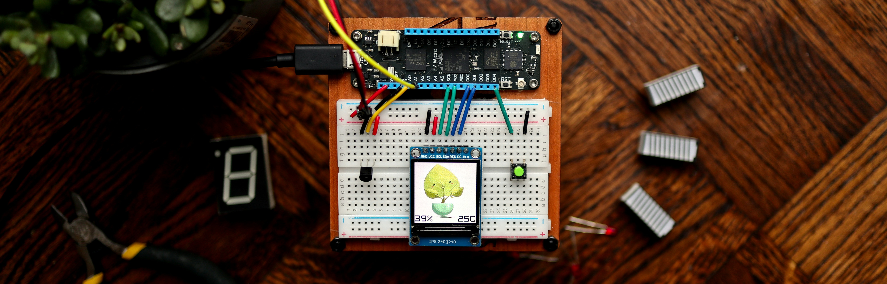

  

<table width="100%">
  <tr>
    <td width="70%" valign="top">
      <h3>About Me</h3>
      

        Electronics and Telecommunication Engineering student with a strong focus on embedded systems and real-time electronics.
        Experienced in transforming theoretical concepts into functional hardware through hands-on prototyping, testing, and debugging.
        Skilled in analyzing real-world system behavior to enhance both firmware and hardware performance.
        Actively seeking entry-level opportunities to contribute technical expertise within a collaborative, industry-driven team.
      

    </td>
    <td width="50%" valign="middle">
      

        
      

    </td>
  </tr>
</table>

---

## Socials -

---

##  Hardware Platforms  (Currently Working On) -

## Tools (Currently Working On) -

---

## Programming Languages  -

  

  <em> "I am Iron Man… building circuits by day, debugging code by night!"</em> 
  <em>⚡ Hardware glitches are scarier than villains, and software bugs are deadlier than Thanos!</em>

